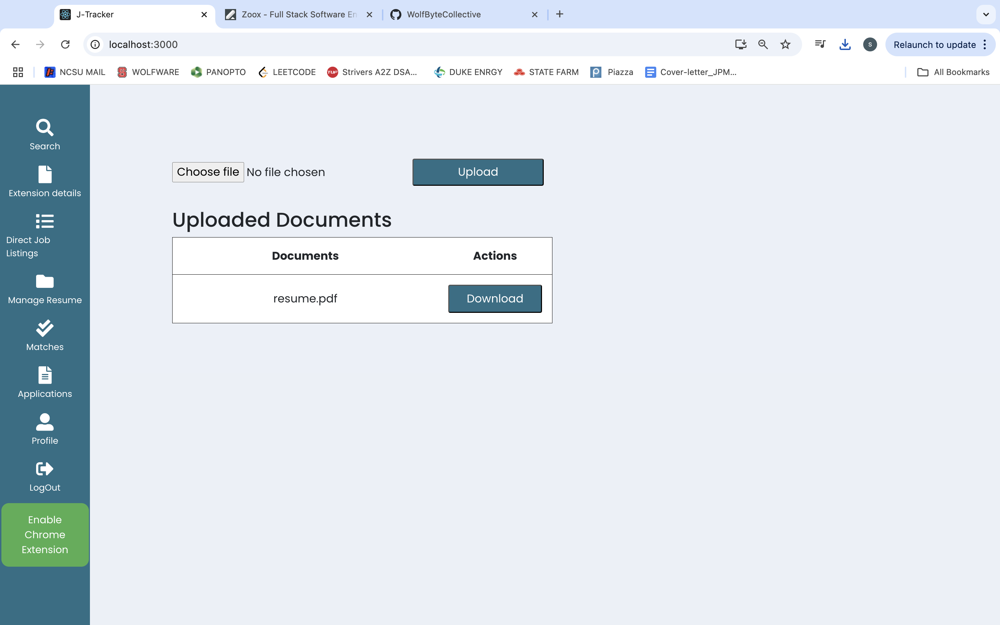

# J-Tracker - Your Job Tracking Assistant

[](https://github.com/jashgopani/application-tracking-system/blob/main/LICENSE)
[](https://doi.org/10.5281/zenodo.14226727)
[](https://codecov.io/gh/WolfByteCollective/application-tracking-system)
[](https://github.com/WolfByteCollective/application-tracking-system/actions/workflows/coverage.yml)
[](https://github.com/WolfByteCollective/application-tracking-system/issues?q=is%3Aopen+is%3Aissue)
[](https://github.com/WolfByteCollective/application-tracking-system/issues?q=is%3Aissue+is%3Aclosed)


[prettier-badge]:https://img.shields.io/badge/code--formatter-Prettier-blue
[prettier-url]:https://github.com/SoftwareEngineering-HomeWork/application-tracking-system/blob/dev/new_backend/package.json#L23

[](https://github.com/WolfByteCollective/application-tracking-system/actions/workflows/lint.yml)


<p align="center"></p>

The process of applying for jobs and internships is not a cakewalk. Managing job applications is a time-consuming process. Due to the referrals and deadlines, the entire procedure can be stressful. Our application allows you to track and manage your job application process, as well as regulate it, without the use of cumbersome Excel spreadsheets.

Our application keeps track of the jobs you've added to your wish list. It also keeps track of the companies you've already applied to and keeps a list of any rejections. Rather than having the user browse each company's site for potential prospects, our application allows the applicant to search for them directly using basic keywords. Any prospective work offers can then be added to the applicant's wishlist.


## New Features
🎥[Demo Video](https://youtu.be/TW7JNjXxD-Q)

## ⭐ Highlights ⭐

### 1. Launch the Recruiter Dashboard for Job Management

Develop a comprehensive recruiter dashboard where recruiters can log in, create job listings with detailed information (e.g., role, skills, salary range, and description), and track all jobs they’ve posted. This milestone focuses on equipping recruiters with a centralized platform to simplify the job creation process and ensure better visibility and control over their postings.

### 2. Implement Candidate Application Portal

Introduce a user-friendly candidate application interface allowing job seekers to browse available jobs and submit applications seamlessly. This milestone ensures candidates have an accessible and engaging platform to connect with opportunities, fostering a streamlined recruitment pipeline that benefits both recruiters and applicants.

### 3. Expand Job Data Coverage via Multi-API Integration

Develop and deploy a scalable system to expand job data coverage by integrating multiple public APIs to provide a diverse and comprehensive job database. This includes standardising data structures, automating daily data collection, optimising performance, and implementing user-specific filters for relevance. The system will feature secure API authentication, real-time updates, and error-handling mechanisms to ensure reliability. By incorporating regional and niche job boards, the platform will cater to a broader audience while remaining competitive and up-to-date with market trends.

### 4. LinkedIn and GitHub Integration

Integrate LinkedIn and GitHub to enhance the platform's functionality by enabling recruiters to directly access and filter applicant profiles based on their skills, projects, and professional experience. For users, this integration simplifies linking their LinkedIn profiles and GitHub repositories to strengthen their applications by showcasing relevant qualifications, certifications, and project portfolios. This feature creates a seamless connection between job seekers and recruiters, improving the hiring process and enhancing the overall user 

## Summary
The project aims to build a robust recruitment platform through four strategic milestones. It begins with developing a **Recruiter Dashboard** for managing job postings, ensuring streamlined job creation and visibility. Next, it introduces a **Candidate Application Portal** to create a seamless interface for job seekers to browse and apply for jobs efficiently. The platform will then expand its **Job Data Coverage** by integrating multiple APIs to provide diverse and relevant opportunities while ensuring real-time updates and scalability. Finally, **LinkedIn and GitHub Integration** will enhance functionality by enabling direct access to applicant profiles and portfolios, fostering better matches between candidates and recruiters. This comprehensive approach ensures an engaging, efficient, and data-rich recruitment experience for all users.

---

### Application Demo video

[https://user-images.githubusercontent.com/89501363/144725439-5d9191f8-df13-4814-aa15-99cd752ab0cc.mp4](https://youtu.be/TW7JNjXxD-Q)

## Table of contents


- [Samples](#samples)
- [New Features In Phase 4](#new-features-in-phase-4)
- [Future Scope](#future-scope)
- [Explanation](#explanation)
- [Technologies Used](#technologies-used)
- [Installation](#installation)
  - [Requirements](#requirements)
  - [Steps to follow for the installation](#steps-to-follow-for-the-installation)
- [Hosting the Database](#hosting-the-database)
  - [Local MongoDB](#local-mongodb)
  - [Hosted database with MongoDB Atlas](#hosted-database-with-mongodb-atlas)
- [License](#license)
- [How to Contribute](#how-to-contribute)
- [Team Members](#team-members)


## Samples:

### Recruiter Dashboard

The introductory visual interface displayed from which a Recruiter is able to register and log into the application. 


### Recruiter - Post Job

After Logging In, the recruiter can post a job by filling in various fields.


### Recruiter - Job Postings

The Recruiter can look at all the job postings he/she has posted. 


### Recruiter - Applicants

The recruiter can see the details of the applicants that have applied to his job postings


### Resume Upload



### MatchesPage


## Future Scope:

- Add a feature that allows users to attach interview reminders to their Google calendar.
- Direct connection to Linkedin, allowing for the addition of job opportunities to the wishlist.
- Enhance chrome extension to allow injecting the data directly to the required fields and thus removing the need to copy and paste content
- Integrate video interview scheduling and conducting directly on the platform.
- Authenticate employment history with tamper-proof records


## Explanation:

Currently, we have these fundamental steps in our project:

1. LinkedIn and GitHub Integration: Direct Integration with LinkedIn and GitHub increases the tool's functionality by making it convenient for the recruiters to navigate and filter out profiles of the applicants and it also helps users to strengthen their applications.

2. Streamlined Recruitment Workflow : Empower recruiters with a dedicated dashboard to effortlessly post jobs, manage applications, and access candidate details, including skills and resumes, all in one place.

3. Seamless Candidate Experience:  Enable candidates to browse and apply for jobs with ease, ensuring their information and resumes are instantly available to recruiters for efficient shortlisting and hiring.

4. Competitive Engagement through Leaderboards: A leaderboard for quiz performance fosters a motivating and competitive environment. Users can track progress, aim for higher ranks, and stay engaged.

5. Web Scraping for Wider Job Data Coverage: Collecting job data from more public APIs enables access to a wider variety of opportunities, keeping the platform competitive and up-to-date. 

## Technologies Used:

- Python
- Node.Js
- Flask
- MongoDB
- React
- Express JS
- HTML
- CSS
- Mocha
- Chai
- Cypress

## Installation:

### Requirements:

- [npm](https://nodejs.org/en/) (Latest version 6.14.4 used as of 11/3)
- [node](https://nodejs.org/en) (Latesrt version 23.1.0)
- [MongoDB Community Edition or use MongoDB Atlas](https://www.mongodb.com/docs/manual/administration/install-community/)

### Steps to follow for the installation:

1. **Clone the Repository**
    - Use the command `git clone https://github.com/WolfByteCollective/application-tracking-system.git` to clone the repository.

2. **Start the Backend**
    - Ensure that node is installed on your system. If not, you can download it from the official Node JS website.
    - Change directory to new_backend
    - Run the command 'npm start'
    - Also change the directory to dashboard for recruiter page and run the command 'npm start'

3. **Start the backend for web scraping**
    - Navigate to the scraping folder and start the backend using the following command: python scrape_SWE_List.py
         
4. **Start frontend**
     - Change directory to frontend
     - Run the command 'npm start'

## Hosting the Database:

### Hosted database with MongoDB Atlas:

1. [Create account](https://account.mongodb.com/account/register) for MongoDB
2. Follow MongoDB Atlas [Setup Guide](https://docs.atlas.mongodb.com/getting-started/) to create a database collection for hosting applications
3. Create .env file in the new_backend folder with the following content:
   ```
   MONGO_URI : <MongoDB Cluster URL>
   ```
## License

The project is licensed under the [MIT](https://choosealicense.com/licenses/mit/) license.

## How to Contribute?

Please see our CONTRIBUTING.md for instructions on how to contribute to the repository and assist us in improving the project.

## Team Members

- Akhil Chawla
- Sanjana Dalal
- Priya Gandhi


